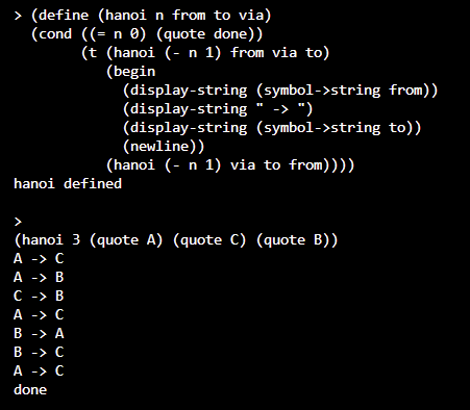
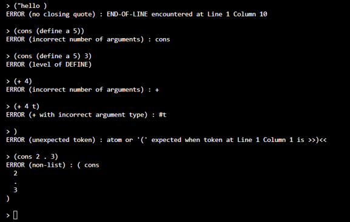

# OurScheme Interpreter

以 C++ 實作的 Scheme 直譯器，採 **Scanner → Parser → Evaluator** 三層架構，支援 S-expression 剖析、遞迴求值與完整的錯誤偵測。

## 1. 架構設計

| 模組 | 職責 |
|---|---|
| Scanner | 逐字元讀取並處理跳脫字元與字串邊界，產生附行列位置（`startLine`／`startColumn`）的 Token，供錯誤精確定位 |
| Parser | 將 Token 遞迴建構為語法樹（`Node`），處理巢狀括號與 quote 語法糖 |
| Evaluator | 依 special form 分派遞迴求值，並以 `Environment` 鏈支援變數綁定與閉包（`Closure`） |

## 2. 支援功能

| 類別 | 內容 |
|---|---|
| 基本型別 | 整數、浮點數、字串、符號、布林值（`T`／`nil`） |
| Special forms | `define` `if` `cond` `and` `or` `begin` `lambda` `let` `set!` |
| 資料操作 | `cons` `list` `car` `cdr` |
| 內建函式 | 算術、比較、字串處理、型別判斷（predicate） |
| 環境與 I/O | `clean-environment` `exit` `read` `write` `display-string` `newline` |
| 除錯與擴充 | `verbose` 模式、`create-error-object`、`error-object?`、`eval` |

## 3. 錯誤處理

各層例外類別皆繼承 `runtime_error`，訊息附精確行列位置：

| 層級 | 例外類別 |
|---|---|
| Scanner | `NoClosingQuote` |
| Parser | `ExpectedAtomOrLeftParen`、`ExpectedRightParen` |
| Evaluator | `UnboundSymbol`、`IncorrectNumberOfArguments`、`WithIncorrectArgumentType`、`AttemptToApplyNonFunction`、`DivisionByZero`，及各 special form 格式錯誤（`DefineFormat`、`CondFormat`、`LambdaFormat`、`LetFormat`、`SetFormat`） |
| 執行層級 | `LevelOfExit`、`LevelOfDefine`、`LevelOfCleanEnvironment`（限 top-level 執行） |

## 4. 執行範例

**圖 1**　定義函式並進行遞迴運算

**圖 2**　針對不同輸入錯誤回報對應訊息

## 5. 使用技術

C++：以 `shared_ptr` 管理語法樹節點與環境生命週期，以 `unordered_map` 實作變數查找。