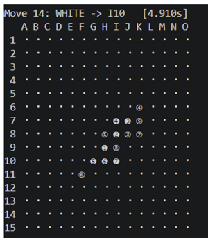

# Gomoku White-Side AI（五子棋白方 AI）
 

 
以 **Minimax + Alpha-Beta Pruning** 為核心、搭配自訂啟發式評分的五子棋白方 AI，透過 stdin/stdout 與裁判程式通訊，每步須於 5 秒內完成。
 
| 檔案 | 說明 |
|---|---|
| `hw1_11220105.py` | 白方 AI（本專案） |
| `engine_minimax.py` | 黑方對手引擎 |
 
## 核心設計
 
採用傳統 minimax（原版為 negamax），相較原版只評估基本連線型態，本程式加入複合威脅、不對稱權重與禁手陷阱。決策由兩個函數分工：
 
- **`move_priority()`｜候選步排序**：每層展開前評估各步的戰術價值（取勝、阻擋、成活四等），只保留前 `max-candidates` 個分支，提升剪枝效率。
- **`evaluate_board()`｜葉節點評估**：搜尋到底或超時時對整體盤面做全局評估，分數沿搜尋樹回傳。
## 評分機制
 
依重要程度由上而下逐項累加：
 
1. **連棋型態**：五連、活四、衝四、活三、衝三、活二、死二
2. **複合威脅**：雙活四、雙活三、四三
3. **Position Heuristic**：依 `neighbor_radius` 優先落子於鄰近已有棋子處
4. **Black Forbidden Trap**：將可能形成黑棋禁手的位置加入白方分數
**不對稱權重**：白方以防守為主，活四、活三及複合威脅的黑棋分數高於白棋；其餘型態白棋分數較高，保留進攻能力。
 
## 已知限制
 
- **時間控制**：`TIME_LIMIT = 4.9` 秒，超時即直接評估當前盤面，深度 ≥ 6 時易漏防關鍵棋步，故深度暫設為 5，未來可改用迭代加深（iterative deepening）。
- **對手強度**：初期以深度 2 的對手測試，對手加深後白方多陷入被動防守。
## 使用技術
 
Python