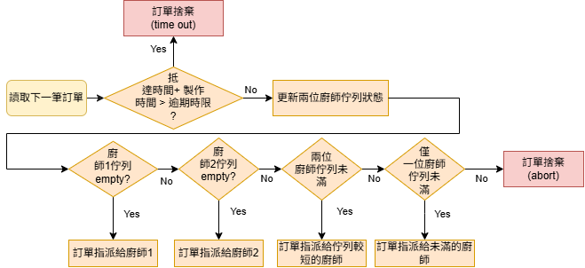
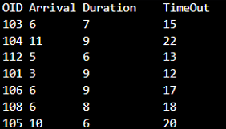
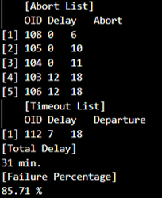

# Dual-Chef Order Scheduling Simulator (FIFO vs. SQF)

以佇列（Queue）模擬餐廳點餐系統，比較**單一廚師 FIFO** 與**雙廚師 SQF(Shortest Queue First)** 兩種排程策略在訂單湧入時的服務效率與失敗率（逾時、爆單）。

## 1. 訂單模型

每筆訂單含到達時間（Arrival）、烹調時長（Duration）與逾時上限（TimeOut）。

## 2. 判定規則

| 情況 | 結果 |
|---|---|
| 佇列已滿（容量 3） | 新訂單直接記入 **Abort List** |
| 處理完成時間超過 TimeOut | 記入 **Timeout List**，並計算延遲時間 |
| 在時限內完成 | 正常出餐 |

## 3. 排程策略

| 指令 | 策略 | 分配方式 |
|---|---|---|
| `Command2` | 單廚師 FIFO | 所有訂單依到達順序進入單一佇列，逐一處理 |
| `Command3` | 雙廚師 SQF | 依序判斷：① 優先分配給閒置廚師 ② 皆忙碌則分配給佇列較短者 ③ 長度相同選 CID 較小者 ④ 兩佇列皆滿則放棄（Abort） |

## 4. 輸出統計

- **Abort List／Timeout List**：含每筆訂單的延遲時間
- **Total Delay**：總延遲分鐘數
- **Failure Percentage**：逾時與放棄訂單占「理論上可準時完成」訂單的比例

## 5. 程式流程與執行範例

**圖 1**　程式流程圖

**圖 2**　讀入的訂單（訂單編號、抵達時間、製作時間、逾時時間）

**圖 3**　輸出的捨棄訂單（包含放棄訂單與逾時訂單）

## 6. 使用技術

C++：以 Shell Sort 依到達時間排序輸入資料，並以 `vector` 實作佇列與訂單清單管理。