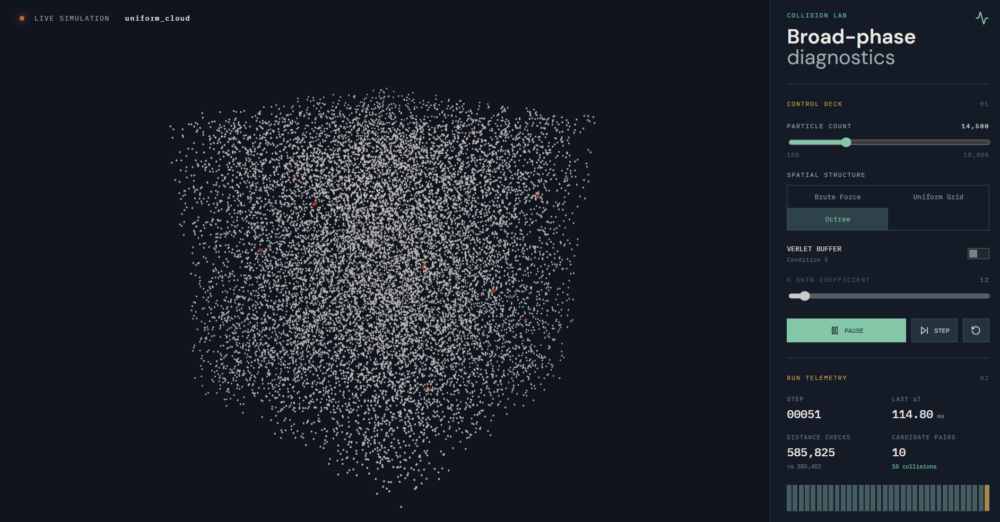

# 碰撞偵測方法比較




# Collision資料夾

大學專題（碰撞偵測方法比較）的核心研究實作，使用 C++17 撰寫。目的是在**不改變碰撞判定正確性**的前提下，比較不同 broad-phase 空間分割結構、以及 Verlet buffer（緩衝殼）機制對重建次數與整體效能的影響。研究範疇明確排除重力／N-body 敘事，粒子運動僅作為碰撞測試資料生成（邊界反彈 + 隨機初速度）。

## 目錄結構

```
collision/
├── CMakeLists.txt
├── include/
│   ├── particle.h            # Particle 資料結構
│   ├── broad_phase.h         # UniformGrid、Octree 兩種 broad-phase 結構
│   ├── narrow_phase.h        # 球體重疊判定（narrow-phase）
│   ├── brute_force.h         # Brute force 基準（O(n²)，同時作為 ground truth）
│   ├── verlet_buffer.h       # Verlet buffer：skin 計算、上限裁切、rebuild 判斷
│   ├── collision_response.h  # 彈性碰撞衝量、邊界反彈
│   ├── scenario.h            # 測試場景產生器（uniform cloud、explosion、spatial cluster…）
│   ├── simulation.h / .cpp   # 整合上述模組的模擬迴圈主體
│   └── glm/                  # 第三方向量數學函式庫（vendored）
├── bench/
│   ├── bench.cpp             # Benchmark 進入點
│   └── bench_runner.h        # Benchmark 掃描邏輯與 CSV 輸出
├── test/
│   ├── test_correctness.cpp  # Brute force vs. Uniform Grid 正確性比對
│   └── test.cpp              # 早期手動測試（介面較舊，僅供參考）
└── info/
    └── benchmark*.csv        # 已產生的 benchmark 結果
```

## 核心概念

### 兩階段碰撞偵測（Broad-phase / Narrow-phase）

- **Broad-phase**：先用空間分割結構快速篩出「可能碰撞」的候選配對（candidate pairs），避免對所有粒子兩兩比較。
- **Narrow-phase**（`narrow_phase.h`）：對候選配對做精確判定，以球體重疊公式 `(r_a + r_b)² >= |pos_a − pos_b|²` 判斷是否真的碰撞，公式以 `glm::distance2` 計算平方距離，避免不必要的開根號。

### Broad-phase 結構一：Uniform Grid（`broad::UniformGrid`）

- 將世界空間依固定 `cellSize_` 切成規則格子，`posToCell()` 以 `floor(pos / cellSize)` 求出格子座標。
- 格子座標以 `key()` 編碼成單一 `int64_t`（每軸偏移 `1<<20` 避免負數，再各自左移 42 / 21 / 0 位並用 XOR 組合），存入 `std::unordered_map<int64_t, std::vector<int>>`，也就是**顯式的 hash-based 稀疏格子**，不需要預先配置整個世界的格子陣列。
- `CollectPairs()` 對每個非空格子：
  1. 先檢查格子內部粒子兩兩配對；
  2. 再用固定的 **13 個「前向」鄰接偏移量**（`forwardOffsets()`）檢查鄰近格子——只往半邊方向找鄰居，確保每一對跨格子的粒子只會被檢查一次，不會因為雙向掃描而重複計算或重複輸出配對。
  3. 每組配對輸出前都會把索引排序成 `(小, 大)`，保持配對表示一致。

### Broad-phase 結構二：Octree（`broad::Octree`）

- 標準 8 叉樹：`Node` 存 `center`、`halfExtent`、葉節點的 `indices`，內部節點的 `children[8]`。
- `insert()` 遞迴插入，當葉節點粒子數超過 `leafCapacity_` 且深度未達 `maxDepth_` 時呼叫 `split()` 一分為八（`maxDepth` 上限是為了避免粒子高度重疊、密集分佈時的無窮遞迴——研究過程中已知並修正過的 bug）。
- `collectPairs()`：
  1. 每個葉節點內部粒子兩兩比對；
  2. 葉節點兩兩之間先以 `boxesOverlap()`（外加半徑 + skin 的 `margin`）做包圍盒快速剔除，通過才逐一比對節點內粒子。

### Verlet Buffer（緩衝殼機制，`verlet_buffer.h`）

這是本研究的核心貢獻，用來降低 broad-phase 重建（rebuild）頻率：

- 每個粒子除了半徑 `radius` 外，額外維護一層 **skin**（緩衝殼半徑）與上次 broad-phase 建構時的位置 `posAtLastBroadPhase`。
- `updateLocalSkin()`：`skin = K·|v|·dt + 0.5·K²·|a|·dt²`，只在 **rebuild 當下**計算一次（而非每一幀都套用），這是正確性證明的前提，也是規格書中特別強調、避免重蹈覆轍的一個坑。
- Skin 上限裁切，避免 skin 過大導致候選配對暴增或超出結構邊界：
  - Uniform Grid：`capSkinToCellSize()`，上限為 `cellSize/2 − radius`（需考慮兩顆粒子的延伸半徑相加，而非單純 `cellSize − radius`——這是實作過程中修正過的正確性 bug）。
  - Octree：`capSkinToLeafExtent()`，上限為該粒子所屬葉節點的 `halfExtent − radius`。
- `listStillValid()`：對應論文的 **Condition 5** —— 只要所有粒子「自上次 broad-phase 以來的位移」都沒有超過各自的 skin（`Δx_p ≤ skin_p`），候選配對表就仍然有效，可以跳過本幀的 broad-phase 重建，直接沿用快取的候選配對做 narrow-phase。
- K 值愈大，skin 愈厚、rebuild 愈少，但候選配對數量也會上升；`bench_runner.h` 即以此做效能／正確性的權衡分析（見下方 Benchmark）。

### 模擬主迴圈（`Simulation::step()`，`simulation.cpp`）

1. **BruteForce 模式**：每幀直接執行 O(n²) 全配對比較，做為正確性基準，不涉及 rebuild 概念。
2. **UniformGrid / Octree 模式**：
   - 呼叫 `needsRebuild()`（第一幀，或 Verlet buffer 失效時）決定是否重建 broad-phase 結構；重建時同步更新 skin 並記錄 `posAtLastBroadPhase` 快照。
   - 對快取的候選配對逐一做 narrow-phase 判定，取得真正碰撞的配對。
3. 碰撞配對排序後交給 `collision_response.h`：
   - `resolveCollisions()`：一般質量版彈性碰撞衝量（沿碰撞法線），並依質量反比做位置修正，避免同一對粒子連續多幀卡在一起。
   - `reflectOffWalls()`：世界邊界（以原點為中心、`[-worldSize/2, worldSize/2]`）反彈。
4. 每幀個別記錄 broad-phase／narrow-phase／response 三段耗時、是否重建、候選配對數、碰撞數，寫入 `FrameInfo`，供 benchmark 與正確性比對使用。

### 測試場景（`scenario.h`）

提供多種可重現（seed 固定）的粒子初始化方式：`two_particle_bounce_scenario`（雙粒子對撞，debug 用）、`uniformCloud`（均勻分布）、`explosion`（原點爆散）、`spatialCluster`（可調整聚集比例、熱點數量、少量「高速粒子」比例的複合場景，是目前 benchmark 實際使用的場景）。

## Benchmark（`bench/`）

- `bench.cpp` 建立 `BenchmarkRunner` 並執行 `run()`，輸出到 `benchmark.csv`。
- `bench_runner.h` 的比較矩陣：
  1. 先以 `BruteForce` 跑一次做 **ground truth**（每幀的碰撞配對集合）。
  2. 分別跑 `uniform_grid`、`octree` 兩個「無 buffer」基準（`hasSkin=false`，每步都視同重建）。
  3. 再對一組等比取樣的 K 值（1, 2, 5, 10, 20, 50, 100, 200, 500, 1000）分別跑 `uniform_grid_skin`、`octree_skin`，每個組合重複 `repeatCount`（預設 10）次取平均與標準差。
- 每個組合輸出的欄位包含：`total_time_avg_s` / `std`、`broad_time_avg_s`、`narrow_time_avg_s`、`response_time_avg_s`、`rebuild_count`、`avg_candidate_per_rebuild`、`correctness_ok`（是否與 ground truth 逐幀比對通過）、`first_mismatch_frame`。
- `info/benchmark*.csv` 是已產生的實驗結果，可直接用於報告分析（例如觀察到 K 值愈大、rebuild 次數愈少，但 narrow-phase 需檢查的候選配對數上升，兩者存在明顯 trade-off）。

## 正確性驗證（`test/`）

- `test_correctness.cpp`：以相同粒子初始場景分別跑 `Method::BruteForce` 與 `Method::UniformGrid`（皆開啟 skin），逐幀比對 `collisionPairs` 是否完全一致，作為 Uniform Grid + Verlet buffer 邏輯正確性的迴歸測試。
- `test.cpp`：較早期、使用舊版 `Simulation` 建構子介面（`Simulation(particles, cfg, totalFrames)`、`FrameStats`）撰寫的手動測試，與目前 `simulation.h` 的介面已不相容，保留僅供參考，非目前建置目標。

## 建置與執行

需要 CMake ≥ 3.14、支援 C++17 的編譯器。

```bash
cd collision
mkdir -p build && cd build
cmake ..
cmake --build .

./bench              # 執行 benchmark，於當前目錄輸出 benchmark.csv
./test_correctness   # 執行正確性比對，輸出 PASS/FAIL
```

`glm` 已以原始碼形式附帶於 `include/glm/`，不需額外安裝依賴。

# System資料夾

基於`Collision Folder`所設計之可視化系統，對於相關的碰撞偵測進行模擬展示。