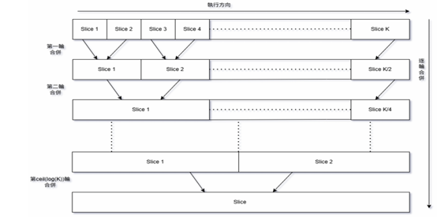
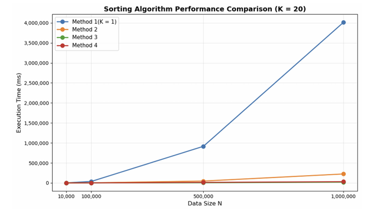

# Parallel Sorting: BubbleSort + MergeSort with Multi-Process / Multi-Thread

比較單一流程、多進程（multi-process）、多執行緒（multi-thread）三種平行化策略，對大量資料進行 BubbleSort + MergeSort 排序之效能表現，並實測驗證理論時間複雜度與實際開銷之間的落差。

## 四種實作方法

1. **Baseline**：整筆資料直接 BubbleSort，$`O(N^2)`$
2. **單一 process 切片**：切成 K 份後於同一 process 內逐一 BubbleSort，再以遞迴 TreeMerge 合併，$`O\left(\frac{N^2}{K} + N\log K\right)`$
3. **Multi-process**：以 `mmap()` 建立 shared memory，`fork()` 產生 K 個 child process 各自排序，再以 K−1 個 process 進行 TreeMerge，並以 `waitpid()` 回收避免 zombie process
4. **Multi-thread**：以 `<thread>` 建立 K 個 thread 各自排序，`join()` 回收後再以 thread 進行 TreeMerge（thread 共享 data section，不需 shared memory）

**圖 1**　TreeMerge 示意圖

**圖 2**　四種方法的執行效能比較（以 $K=20$ 為例）

## 關鍵發現

- **切片數 K 越大不代表越快**：K 值夠大時，process/thread 的建立與回收開銷會反過來主導總執行時間，使實際表現偏離理論複雜度 $`O(N^2/K^2 + N\log K)`$——例如 K=5000、10000 時，方法三、四的執行時間不減反增。
- **切太細之後，執行時間與資料量 N 脫鉤**：當每個切片小到 BubbleSort 幾乎不耗時，執行時間便完全由 process/thread 的建立、context switch、同步等待（`waitpid()`/`join()`）主導，導致不同 N 的執行時間趨於一致。
- **Process 開銷 > Thread 開銷**：在相同 K 值下，multi-process（方法三）之執行時間持續高於 multi-thread（方法四），因建立 process 之成本高於建立 thread。
- **平行化的效益門檻**：唯有資料量 N 與切片數 K 皆夠大時，多進程/多執行緒之優勢才會顯現（例如 N=500K、1M 時，方法三、四明顯優於單一 process 之方法二）；資料量不足時，平行化管理成本反而可能拖慢整體效能。

## 開發環境

Windows + WSL2（Debian）、g++ 14.2.0

## 使用技術

C++（`<sys/mman.h>` shared memory、`<unistd.h>` fork/waitpid、`<thread>`）