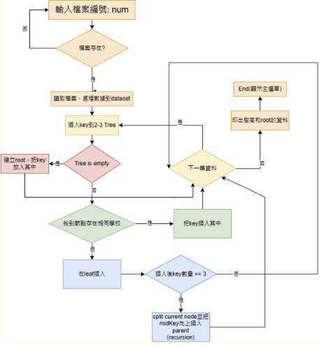
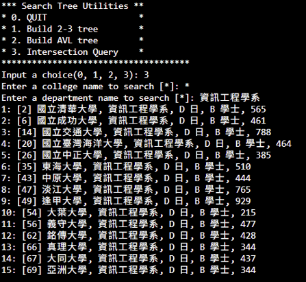

# University Department Search: 2-3 Tree + AVL Tree

同時建構 **2-3 Tree**（以校名為 key）與 **AVL Tree**（以科系名稱為 key）兩種平衡樹結構，儲存大學校系統計資料，並支援跨樹交集查詢（例如「查詢某校 × 某科系」的所有符合紀錄）。

## 資料結構設計

- **2-3 Tree**：以 `schoolName` 為 key，每個節點可容納 1～2 個 key（2-node/3-node）。插入時若葉節點超過容量，依中間值向上分裂（`splitNode`），並遞迴處理父節點分裂，維持樹高平衡。
- **AVL Tree**：以 `department` 為 key，插入後檢查左右子樹高度差，若失衡（差值 > 1）則依 LL/LR/RL/RR 四種情況執行單旋轉或雙旋轉（`rotateLeft`/`rotateRight`）復原平衡。
- 每個樹節點的 key（`SchoolKey`）底下以 `vector<Data*>` 儲存所有具相同 key 值的紀錄，同一校名或科系可對應多筆資料。

**圖 1**: 2-3樹建立之流程圖

## 查詢功能

- 輸入校名與科系名稱（皆可用 `*` 表示不限），分別在兩棵樹中定位對應節點取出候選集合
- 對兩組候選集合取交集，並依原始輸入順序（`inputOrder`）排序後輸出
- 特殊情況處理：校名或科系任一為 `*` 時，直接以另一棵樹的查詢結果與完整資料集比對

**圖 2**: 使用者輸入資訊工程學系，系統根據檔案從中抓取資料並輸出

## 使用技術

C++（樹狀結構以指標實作，`vector` 儲存節點內多筆記錄與交集運算）